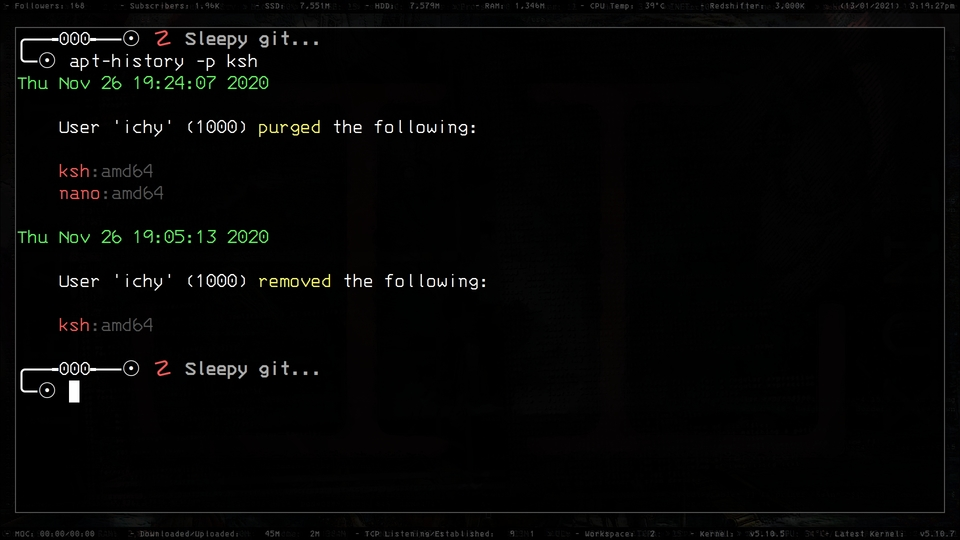
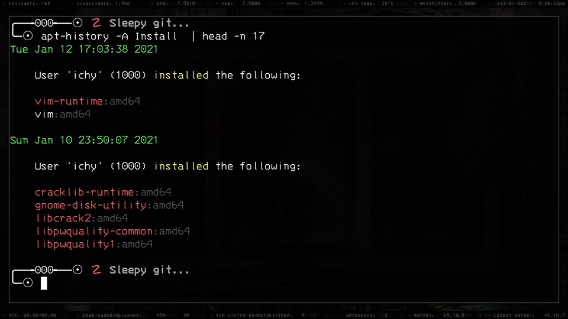
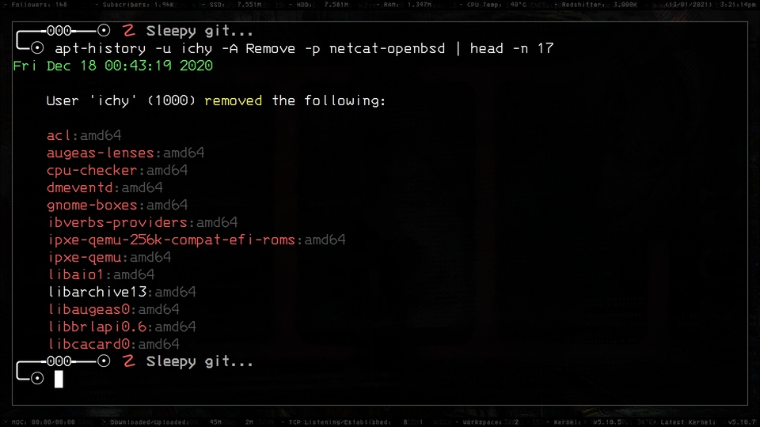

**MASTER** - _Hopefully stable branch._\
**DEV** - _Development Branch (latest changes)_

# APT History

With useful filtering features and charming, yet simple and configurable output, you can use APT History to enhance your APT package log-viewing needs.

* Video: [New APT History Project for Debian/Ubuntu SysAdmins](https://www.youtube.com/watch?v=NRKhxaL0kGQ)
* Video: [Handy Updates to New APT History SysAdmin Tool](https://www.youtube.com/watch?v=bV-Ts8OE2tE)

There may well be more, but for those, you can head over to the YouTube channel, [Learn Linux](https://www.youtube.com/c/learnlinux).

It's possible to filter by package name, with or without the package's target architecture.



You can filter by user name or ID. Using head(1) so you can see the command.



You can string filters together, as you would expect, in order to really narrow down the listing.



Here's a brief overview by way of its usage output, as of 2021-01-11:

```
Usage: apt-history [OPTS]

  -h, --help               - Display this help information.
  -v, --version            - Output the version datestamp.
  --no-color-status        - Don't show packages not installed in red.
  -A, --action [TYPE]      - Filter action by TYPE. See below.
  -C, --no-color           - Disable ANSII color escape sequences.
  -D, --display [STYLE]    - Display packages in STYLE. See below.
  -H, --history [FILE]     - Use an alternative 'history.log' file.
  -U, --user-id [UID]      - Filter the logged results by UID.
  -c, --command            - Also show the actual command executed.
  -p, --package [PKG]      - Show results affecting only PKG.
  -r, --reverse            - Display history in reverse; oldest first.
  -u, --user [USER]        - Filter the logged results by USER.

  Available package listing STYLEs are 'OneLine' and 'Wrapped'.
  Available TYPEs are 'Install', 'Purge', 'Remove', and 'Upgrade'.

  If color is enabled, packages in red are no longer installed.
```

APT History also supports useful BASH completion and comes with a man page.
