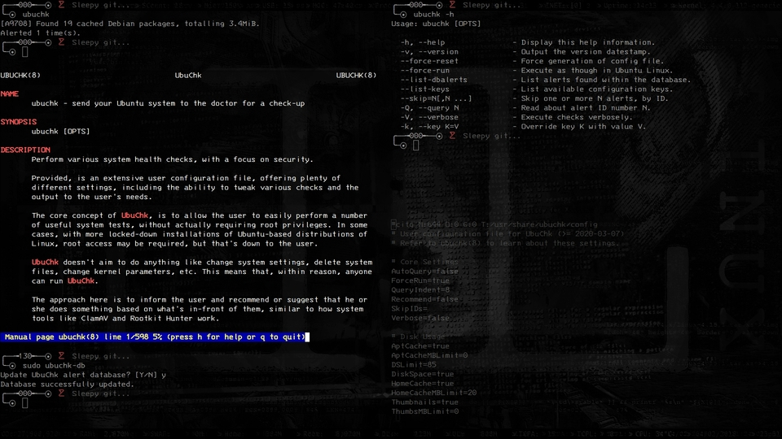
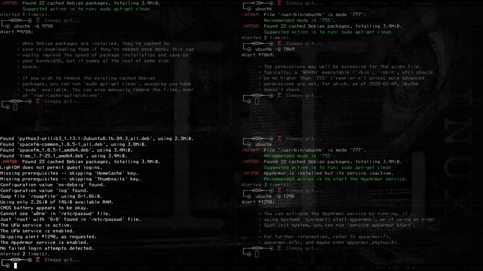

**MASTER** - _Hopefully stable branch._\
**DEV** - _Development Branch (latest changes)_

# Introduction

UbuChk -- a vast upgrade to its old predecessor -- is an administrative tool to determine various aspects of system health, with a focus on a safer system. Whether it's checking CPU temperatures, PATH executables, disk space, security settings for APT, over 70 rootkits, potentially unwanted packages, or questionable kernel parameters, UbuChk is looking out for you.

Thanks to UbuChk being written in Perl, performance is a huge leap forward. This tool offers the potential additional portability, despite targeting Ubuntu users, allowing the user to roll the dice, forcing UbuChk to run as though in a supported Ubuntu installation of Linux.



More care has been given to the user's experience, particularly to those whom are perhaps not so experienced with Linux. By default, for any of the 160+ given alerts, text briefly recommending or suggesting an action or value is displayed to the user; this can be disabled, however.

Alongside the rootkit database, UbuChk also comes with an alert database, storing various `queries`, which are essentially tidbits of information the user can read to better understand why they were alerted, what they can do, and/or if it's worth doing anything at all. Ultimately, however, it's up the user.



The core concept of UbuChk is as it always has been: to inform the user, but _not_ to actually _do_ anything. UbuChk will _not_ delete critical files, mess with system settings, or do anything else of concern which can be hard to track, as you may find with other system health utilities; all of this is **entirely** left to the user's discretion.

Want to [see UbuChk in action](https://youtu.be/CZ4Kn0gtHaM) right now?

Alerts are each assigned an Alert ID consisting of a 4-digit number, which can easily be used to either query UbuChk itself (see: `ubuchk -h`), or perhaps seek help elsewhere, making the ID an easy reference point.

The future of UbuChk looks bright, with development ongoing, and plenty of room for further expansion.

UbuChk has been developed for and used in variations of Ubuntu 16.04, 18.04, and 20.04. Distributions based on regular Ubuntu (that one with GNOME 3), such as Linux Mint, Linux Lite, Peppermint OS, and Zorin OS, should all be capable of running UbuChk, although some features may not work as intended.

The _ubuchk(8)_ manual page offers plenty of further reading, including definitions for each of the 60+ user configuration keys.

Thank you for your interest and time.

# Installation Instructions

Installation can be done with [Cito](https://github.com/terminalforlife/Extra/blob/master/source/cito), but it's unnecessarily involved, due the size of UbuChk. Therefore, your best bet is one of two options:

  * Install via [UbuChk's DEB package](https://github.com/terminalforlife/DEB-Packages/tree/master/ubuchk) for Debian- and Ubuntu-based systems.
  * Install via UbuChk's [installation script](https://github.com/terminalforlife/PerlProjects/blob/master/source/ubuchk/ubuchk-installer).

For a quick terminal one-liner, using the aforementioned installation script, you should be able to execute the following, assuming you have sudo(8):

```sh
(cd /tmp; curl -so ubuchk-installer 'https://raw.githubusercontent.com/terminalforlife/PerlProjects/master/source/ubuchk/ubuchk-installer' && sudo \sh ubuchk-installer; rm ubuchk-installer)
```

If that fails, you probably don't have curl(1), so try wget(1):

```sh
(cd /tmp; wget -qO ubuchk-installer 'https://raw.githubusercontent.com/terminalforlife/PerlProjects/master/source/ubuchk/ubuchk-installer' && sudo \sh ubuchk-installer; rm ubuchk-installer)
```

If you don't have sudo(8), just omit it from the command(s) above, and run them as the `root` user, however you gain such privileges.

# Dependencies

For those of you returning, note that as of version 2020-11-01, UbuChk no longer requires [libtfl-perl](https://github.com/terminalforlife/PerlProjects/blob/master/source/TFL.pm).

  * libfilesys-diskspace-perl (>= 0.05-16)
  * libnumber-bytes-human-perl (>= 0.09-1)
  * libterm-readkey-perl (>= 2.33-1build1)
  * libtext-wrapi18n-perl (>= 0.06-7.1)
  * perl (>= 5.22.1-9)

If you use `ubuntu-db`, or install via the UbuChk Debian package, you'll also need what's mentioned below.

  * coreutils (>= 8.25-2)
  * libtflbp-sh (>= 2019-12-10)
  * wget (>= 1.17.1-1) | curl (>= 7.47.0-1) | [cito](https://github.com/terminalforlife/Extra/blob/master/source/cito) (>= 2020-02-29)

If you're on an Ubuntu or similar system, you can use `sudo apt-get install -f` to get all of the remaining missing dependencies sorted, but **only** IF and AFTER you install the Debian package.

# Want to Take Part?

Whether you wish to contribute code, add to the databases, or report bugs and other issues, your support here would be appreciated.
